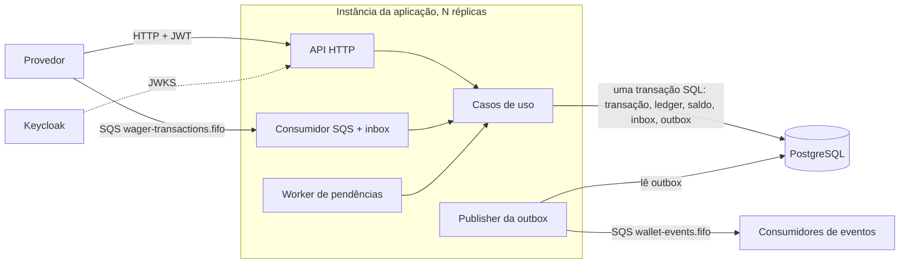

# Wallet & Wagering Service

Serviço em Go que movimenta carteiras de jogadores a partir de operações de jogo (`BET`, `WIN`, `LOSS`, `REFUND`, `ROLLBACK`) recebidas por **HTTP** e por **SQS**, com as mesmas garantias nos dois canais:
- idempotência persistente;
- ledger append-only;
- concorrência segura entre várias instâncias;
- inbox/outbox;
- espera por referências que ainda não chegaram;
- reconciliação.

## Documentação

- Enunciado do desafio: [`docs/CHALLENGE.md`](docs/CHALLENGE.md)
- Decisões de arquitetura, limitações e interpretações: [`ARCHITECTURE.md`](ARCHITECTURE.md)

## Visão geral



**Stack:**
- Go 1.27.1, Uber Fx, chi, pgx/v5 (SQL explícito, sem ORM), golang-migrate;
- aws-sdk-go-v2, coreos/go-oidc, Prometheus, `slog` (JSON);
- PostgreSQL 16, LocalStack 4.14 (SQS), Keycloak 26.8.

## 1. Pré-requisitos

| Ferramenta | Para quê |
| --- | --- |
| Docker + Docker Compose v2 | subir o ambiente e os testes de integração (testcontainers) |
| Go 1.27.1 | rodar os testes fora de containers |
| `make` | atalhos (opcionais; todos os comandos estão descritos abaixo) |
| `curl` | exemplos de chamadas |

A AWS CLI não é necessária: os comandos de fila usam o `awslocal` que já existe dentro do container do LocalStack.

## 2. Subir o ambiente

```sh
docker compose up --build -d --wait # direto, em segundo plano, aguardando tudo ficar saudável
make up                             # com make, em segundo plano, aguardando tudo ficar saudável
```

Nenhum passo manual é necessário a partir de um checkout limpo. O compose sobe, nesta ordem:

| Serviço | Porta no host | O que faz |
| --- | --- | --- |
| `postgres` | 5432 | banco; cria os roles `wallet_owner` (dono do schema) e `wallet_app` (só DML) |
| `keycloak` | 8081 | IdP; importa o realm `wagering` com os clients de teste |
| `localstack` | 4566 | SQS; cria as filas e as DLQs no boot |
| `migrate` | — | aplica as migrations uma vez e termina |
| `app` | 8080 | a aplicação: API, consumidor SQS, worker de pendências e publisher da outbox |

A `app` só sobe depois que Postgres, Keycloak e LocalStack estão saudáveis e as migrations terminaram. Para confirmar:

```sh
curl -s localhost:8080/health/ready
# {"checks":{"postgres":"ok","sqs":"ok"},"status":"ok"}
```

Para parar: `make down` / `docker compose down` (mantém os dados) ou `make clean` / `docker compose down -v` (apaga os dados).

## 3. Variáveis de ambiente

Todas as variáveis estão em [`.env.example`](.env.example), com valores locais e **sem segredos reais**. O compose lê esse arquivo diretamente. Para sobrescrever algo, crie um `.env` (opcional, ignorado pelo git): `cp .env.example .env`.

A configuração é validada no boot, e um valor inválido impede a aplicação de subir.

| Variável | Padrão | Descrição |
| --- | --- | --- |
| `HTTP_ADDR` | `:8080` | endereço do servidor HTTP |
| `LOG_LEVEL` | `INFO` | `DEBUG`, `INFO`, `WARN` ou `ERROR` |
| `INSTANCE_ID` | hostname | identifica a instância nos logs e nas reservas da outbox |
| `DATABASE_URL` | — (obrigatória) | conexão da aplicação, com o role `wallet_app` |
| `DATABASE_MIGRATE_URL` | — | conexão das migrations, com o role `wallet_owner` |
| `DB_MAX_CONNS` | `10` | tamanho do pool |
| `DB_LOCK_TIMEOUT` / `DB_STATEMENT_TIMEOUT` | `5s` / `10s` | prazos aplicados pelo Postgres |
| `DB_TX_TIMEOUT` | `15s` | prazo de cada transação, aplicado pela aplicação; estourado, vira 503 |
| `OIDC_ISSUER` | — (obrigatória) | `iss` exigido nos tokens (`http://localhost:8081/realms/wagering`) |
| `OIDC_JWKS_URL` | — (obrigatória) | onde buscar as chaves de assinatura (rede interna) |
| `OIDC_AUDIENCE` | `wagering-api` | `aud` exigido nos tokens |
| `AWS_REGION`, `AWS_ENDPOINT_URL`, `AWS_ACCESS_KEY_ID`, `AWS_SECRET_ACCESS_KEY` | — | acesso ao SQS (LocalStack) |
| `SQS_INPUT_QUEUE` / `SQS_INPUT_DLQ` / `SQS_EVENTS_QUEUE` | `wager-transactions.fifo` / `wager-transactions-dlq.fifo` / `wallet-events.fifo` | nomes das filas |
| `SQS_MAX_RECEIVE_COUNT` | `5` | recebimentos até o redrive para a DLQ (usado na criação das filas) |
| `ENABLE_CONSUMER` | `true` | liga o consumidor SQS |
| `SQS_CONSUMER_NAME` | `wallet-service` | nome do consumidor na inbox |
| `SQS_WORKERS` | `2` | goroutines consumindo por instância |
| `SQS_WAIT_TIME` | `10s` | long polling |
| `SQS_VISIBILITY_TIMEOUT` / `SQS_HANDLER_TIMEOUT` | `30s` / `20s` | visibilidade da mensagem e prazo para processá-la |
| `SQS_RETRY_BASE_DELAY` / `SQS_RETRY_MAX_DELAY` | `2s` / `5m` | backoff de falhas transitórias |
| `KNOWN_PROVIDERS` | `provider-a,provider-b` | provedores aceitos pela fila |
| `ENABLE_REFERENCE_WORKER` | `true` | liga o worker de referências pendentes |
| `PENDING_WORKERS` / `PENDING_POLL_INTERVAL` | `2` / `500ms` | paralelismo e intervalo ocioso do worker |
| `PENDING_BASE_BACKOFF` / `PENDING_MAX_BACKOFF` | `1s` / `5m` | backoff exponencial entre tentativas |
| `PENDING_MAX_ATTEMPTS` / `PENDING_TTL` | `10` / `30m` | limites antes de rejeitar com `REFERENCE_NOT_FOUND` |
| `ENABLE_OUTBOX_PUBLISHER` | `true` | liga o publisher da outbox |
| `OUTBOX_WORKERS` / `OUTBOX_BATCH_SIZE` / `OUTBOX_POLL_INTERVAL` | `1` / `50` / `500ms` | paralelismo e lote |
| `OUTBOX_LEASE` / `OUTBOX_PUBLISH_TIMEOUT` | `30s` / `10s` | posse de um evento reservado e prazo do envio |
| `OUTBOX_RETRY_BASE_DELAY` / `OUTBOX_RETRY_MAX_DELAY` | `1s` / `5m` | backoff de falhas de publicação |
| `FAULT_INJECTION_ENABLED` / `FAULT_POINT` | desligado | **só para testes**: derruba o processo num ponto nomeado (ver §9.5) |

## 4. Filas

O script [`deploy/aws/init-queues.sh`](deploy/aws/init-queues.sh) roda dentro do LocalStack no boot e cria:

| Fila | Uso |
| --- | --- |
| `wager-transactions.fifo` | entrada de operações; redrive para `wager-transactions-dlq.fifo` depois de 5 recebimentos |
| `wager-transactions-dlq.fifo` | mensagens inválidas (enviadas direto pelo consumidor, com o atributo `failureReason`) ou com falha transitória persistente |
| `wallet-events.fifo` | eventos publicados pela outbox; redrive para `wallet-events-dlq.fifo` |

As políticas IAM de privilégio mínimo de cada papel estão em [`deploy/aws/iam/`](deploy/aws/iam/). O LocalStack não as aplica (ver `ARCHITECTURE.md`).

Para inspecionar:

```sh
make queues    # lista as filas
docker compose exec localstack awslocal sqs receive-message \
  --queue-url http://localhost:4566/000000000000/wallet-events.fifo \
  --max-number-of-messages 10 --message-attribute-names All --attribute-names All
```

## 5. Migrations

As migrations ficam em [`migrations/`](migrations/) e o serviço `migrate` as aplica automaticamente no `docker compose up`. Para rodar à mão:

| Comando | Efeito |
| --- | --- |
| `make migrate-up` | aplica as pendentes |
| `make migrate-down` | reverte a última |
| `make migrate-down-all` | reverte todas |
| `make migrate-version` | mostra a versão atual |

Os alvos rodam o `golang-migrate` pelo container `migrate`, com o role `wallet_owner`.

## 6. Autenticação e identidades de teste

O realm `wagering` é importado automaticamente de [`deploy/keycloak/realm-wagering.json`](deploy/keycloak/realm-wagering.json). Os tokens são obtidos por `client_credentials`. Os secrets valem só localmente e seguem o formato `<client>-local-secret`.

| Client | Role | `provider_id` | Pode |
| --- | --- | --- | --- |
| `provider-a`, `provider-b` | `provider` | o próprio | enviar e consultar as **próprias** operações |
| `wallet-service` | `wallet-admin` | — | abrir, consultar e reconciliar carteiras; ler qualquer transação |
| `provider-a-short-lived` | `provider` | `provider-a` | igual ao `provider-a`, com token de 2s (testa expiração) |
| `no-role-client` | — | — | autentica, mas recebe 403 em tudo |
| `other-api-client` | `provider` | — | token sem `aud=wagering-api` (recebe 401) |

```sh
ADMIN=$(make -s token-wallet-service)
PROV=$(make -s token-provider-a)
```

Sem o `make`:

```sh
curl -s -u provider-a:provider-a-local-secret -d grant_type=client_credentials \
  http://localhost:8081/realms/wagering/protocol/openid-connect/token
```

Todas as rotas de negócio exigem `Authorization: Bearer <token>`. As únicas rotas públicas são `/health/live`, `/health/ready` e `/metrics`.

## 7. Exemplos de chamadas

```sh
PLAYER=0192f28f-5dc0-7d58-bdb2-814ad6a0f4a1
```

**Abrir carteira** (`wallet-admin`), que responde 201 com `version: 1`:

```sh
curl -s -X POST localhost:8080/wallets -H "Authorization: Bearer $ADMIN" -H 'Content-Type: application/json' \
  -d "{\"playerId\":\"$PLAYER\",\"initialBalance\":{\"amount\":\"100.00\",\"currency\":\"BRL\"}}"
WALLET=<id retornado>
```

**Consultar a carteira e o ledger** (paginação por cursor opaco):

```sh
curl -s localhost:8080/wallets/$WALLET -H "Authorization: Bearer $ADMIN"
curl -s "localhost:8080/wallets/$WALLET/ledger?limit=50" -H "Authorization: Bearer $ADMIN"
```

**Enviar uma aposta** (`provider`). O `Idempotency-Key` é obrigatório:

```sh
bet() { # $1 = externalTransactionId, $2 = amount, $3 = kind (padrão BET), $4 = referência (opcional)
  ref=${4:+,\"referenceExternalTransactionId\":\"$4\"}
  curl -s -X POST localhost:8080/wagering/transactions \
    -H "Authorization: Bearer $PROV" -H 'Content-Type: application/json' -H "Idempotency-Key: provider-a:$1" \
    -d "{\"providerId\":\"provider-a\",\"externalTransactionId\":\"$1\",\"playerId\":\"$PLAYER\",\"walletId\":\"$WALLET\",\"roundId\":\"round-1\",\"gameId\":\"fortune-chimp\",\"kind\":\"${3:-BET}\",\"money\":{\"amount\":\"$2\",\"currency\":\"BRL\"}$ref}"
  echo
}

bet tx-1 25.00             # 201 {"status":"PROCESSED","balance":{"amount":"75.00",...},"idempotentReplay":false}
bet tx-1 25.00             # 200 replay: o mesmo resultado, "idempotentReplay":true
bet tx-1 30.00             # 409 IDEMPOTENCY_KEY_CONFLICT (mesma chave, outro conteúdo)
bet tx-2 500.00            # 422 {"status":"REJECTED","failureCode":"INSUFFICIENT_FUNDS","balance":{"amount":"75.00",...}}
bet tx-9 10.00 REFUND tx-8 # 202 PENDING_REFERENCE: a BET tx-8 ainda não chegou
bet tx-8 10.00             # 201; em seguida o worker aplica o REFUND pendente automaticamente
```

**Consultar uma transação** (o provedor só vê as próprias):

```sh
curl -s localhost:8080/wagering/transactions/<transactionId> -H "Authorization: Bearer $PROV"
curl -s localhost:8080/providers/provider-a/wagering/transactions/tx-9 -H "Authorization: Bearer $PROV"
```

**Reconciliar** (`wallet-admin`): reconstrói o saldo a partir do ledger, sem alterá-lo:

```sh
curl -s -X POST localhost:8080/wallets/$WALLET/reconciliation -H "Authorization: Bearer $ADMIN"
# {"walletId":"...","storedBalance":{...},"calculatedBalance":{...},"difference":{"amount":"0.00",...},"consistent":true,"checkedEntries":4}
```

O contrato completo (códigos HTTP, corpos e failure codes) está em [`ARCHITECTURE.md`](ARCHITECTURE.md#contrato-http-e-failure-codes).

### Envio pela fila SQS

A mensagem leva o mesmo conteúdo do corpo HTTP em `data`, mais o `idempotencyKey`. Use `MessageGroupId = walletId`.

```sh
docker compose exec localstack awslocal sqs send-message \
  --queue-url http://localhost:4566/000000000000/wager-transactions.fifo \
  --message-group-id $WALLET --message-deduplication-id msg-001 \
  --message-body "{\"messageId\":\"msg-001\",\"type\":\"WagerTransactionRequested\",\"occurredAt\":\"2026-10-07T12:00:00Z\",\"data\":{\"providerId\":\"provider-a\",\"externalTransactionId\":\"sqs-tx-1\",\"idempotencyKey\":\"provider-a:sqs-tx-1\",\"playerId\":\"$PLAYER\",\"walletId\":\"$WALLET\",\"roundId\":\"round-1\",\"gameId\":\"fortune-chimp\",\"kind\":\"BET\",\"money\":{\"amount\":\"5.00\",\"currency\":\"BRL\"}}}"
```

A aplicação consome a mensagem sozinha. Depois, a mesma operação enviada por HTTP (`bet sqs-tx-1 5.00`) devolve o replay do resultado do SQS.

## 8. Observabilidade

| Endpoint | Conteúdo |
| --- | --- |
| `GET /health/live` | o processo está vivo |
| `GET /health/ready` | Postgres e SQS acessíveis; responde 503 com o motivo, e `draining` durante o shutdown |
| `GET /metrics` | Prometheus: resultados por canal, replays, conflitos, DLQ, retries, atraso da outbox, latências, divergências de reconciliação |

Os logs são JSON e trazem `instanceId`, `correlationId` (propagado por `X-Correlation-Id`), `transactionId`, `walletId`, `providerId` e `messageId`. Nunca registram tokens nem payloads financeiros completos.

## 9. Testes

### 9.1 Unitários, race e vet (sem dependências externas)

```sh
go test ./...
go test -race ./...
go vet ./...
gofmt -l .      # deve imprimir nada
make check      # gofmt + vet + test -race
```

### 9.2 Integração (build tag `integration`)

Usa containers reais de PostgreSQL, LocalStack e Keycloak, criados pelo **testcontainers**. Só é preciso ter o Docker rodando; o compose não precisa estar no ar.

```sh
make test-integration
# ou: go test -tags integration -race -count=1 ./test/...
```

A suíte leva cerca de 5 minutos e cobre:
- migrations e constraints;
- imutabilidade do ledger;
- atomicidade com falha no meio;
- idempotência;
- concorrência com 3 pools independentes;
- referências pendentes;
- inbox, reentrega, DLQ e redrive;
- outbox concorrente e recuperação;
- reinicialização;
- autenticação real;
- o ciclo de vida do Fx sem vazamento de goroutines.

### 9.3 Múltiplas instâncias (build tag `e2e`)

Sobe **três processos independentes** da aplicação (`app`, `app2`, `app3`, nas portas 8080, 8082 e 8083), cada um com as próprias conexões e memória, sobre o mesmo Postgres, SQS e Keycloak:

```sh
make e2e-up       # docker compose -f docker-compose.yml -f docker-compose.e2e.yml up --build -d --wait
make test-e2e     # go test -tags e2e -race -count=1 ./test/e2e/...
make e2e-down     # derruba e apaga os volumes
```

Cenários, com as requisições distribuídas entre as instâncias:
- a mesma BET 50×;
- duas BETs de 80.00 sobre 100.00;
- 30 carteiras × 20 operações;
- as mesmas operações por HTTP e SQS ao mesmo tempo;
- pendências resolvidas por qualquer instância.

Todos terminam conferindo que a outbox foi publicada e que o saldo de todas as carteiras é igual a créditos − débitos do ledger.

### 9.4 Simulações de falha (build tag `faults`)

Com o ambiente da §9.3 no ar:

```sh
make test-faults  # go test -tags faults -race -count=1 -p 1 -timeout 20m ./test/e2e/...
```

Os testes manipulam containers de verdade (`docker compose stop/up/kill/pause`), por isso ficam numa tag separada. São 8 cenários, que levam cerca de 3 minutos:
- o processo morre (código 137) depois do commit e antes de apagar a mensagem;
- morre entre o commit e a publicação, e entre a publicação e a confirmação na outbox;
- morre antes do commit;
- morre depois de reservar uma pendência;
- as três instâncias são mortas com `kill -9`;
- o Postgres fica pausado;
- o SQS fica pausado.

### 9.5 Injeção de falhas

Quando `FAULT_INJECTION_ENABLED=true`, a aplicação encerra com `os.Exit(137)` ao atingir o ponto nomeado em `FAULT_POINT`:

| Ponto | Onde |
| --- | --- |
| `wager.before_commit` | operação aplicada, antes do commit |
| `consumer.after_commit_before_delete` | depois do commit, antes de apagar a mensagem |
| `outbox.after_claim_before_publish` | evento reservado, antes de publicar |
| `outbox.after_publish_before_mark` | evento publicado, antes de marcar |
| `worker.after_claim` | pendência reservada, antes de aplicar |

No compose normal, essas variáveis não existem. No ambiente e2e, elas valem só para o serviço `app`.

## 10. Estrutura

```
cmd/api                 entrypoint (Fx)
internal/domain         Money, Wallet, LedgerEntry, WagerTransaction, eventos, regras (sem dependências de infraestrutura)
internal/app            casos de uso: carteiras, operações, worker de pendências, reconciliação
internal/store          repositórios SQL e Unit of Work (InTx, ReadSnapshot, Query)
internal/httpapi        rotas, autenticação/autorização, contrato HTTP, health
internal/auth           validação de JWT (OIDC/JWKS)
internal/consumer       consumidor SQS + inbox
internal/publisher      publisher da outbox
internal/worker         Runner genérico e worker de pendências
internal/platform       config, logger, métricas, Postgres, SQS, injeção de falhas
migrations/             schema versionado (golang-migrate)
deploy/                 roles do Postgres, realm do Keycloak, filas e políticas IAM
test/integration        testes com containers reais (tag integration)
test/e2e                três instâncias e simulações de falha (tags e2e e faults)
docs/                   enunciado do desafio
```
